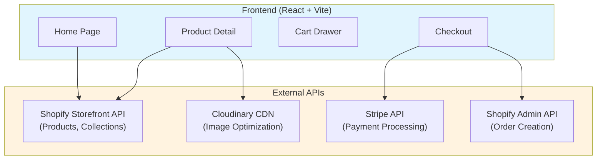
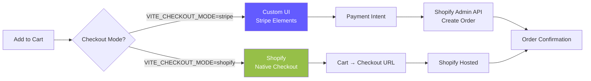

# Gallery Store - Headless Shopify Starter Kit 

[](https://github.com/nathanmcmullendev/ecommerce-react/stargazers)
[](https://github.com/nathanmcmullendev/ecommerce-react/fork)
[](https://www.typescriptlang.org/)
[](https://react.dev/)
[](https://reactrouter.com/)
[](https://pagespeed.web.dev/)
[](/)
[](/)

> **The Problem:** Shopify dev stores block checkout behind a password wall, making it impossible to demo or test the complete purchase flow during development.
>
> **This starter fixes it** with a Stripe fallback that works on free dev stores. Full UI control, or use native Shopify checkout. Switch with one environment variable.

**If this saves you setup time, consider giving it a star — it helps others find it!**

[](https://vercel.com/new/clone?repository-url=https%3A%2F%2Fgithub.com%2Fnathanmcmullendev%2Fecommerce-react&env=VITE_SHOPIFY_STORE,VITE_SHOPIFY_STOREFRONT_TOKEN,VITE_CLOUDINARY_CLOUD,VITE_CHECKOUT_MODE,VITE_STRIPE_PUBLIC_KEY&envDescription=Shopify%20and%20Stripe%20credentials%20required&envLink=https%3A%2F%2Fgithub.com%2Fnathanmcmullendev%2Fecommerce-react%2Fblob%2Fmain%2Fdocs%2Fguides%2FSETUP-CHECKLIST.md)

**[Live Demo](https://ecommerce-react-shopify.vercel.app)** | **[Setup Guide](docs/guides/SETUP-CHECKLIST.md)** | **[Checkout Modes](docs/guides/CHECKOUT-MODES.md)**

---

## At a Glance

<table>
<tr>
<td width="50%">

### Homepage

*Premium gallery layout with featured works*

</td>
<td width="50%">

### Product Page

*Frame preview with 4 options and 4 sizes*

</td>
</tr>
<tr>
<td width="50%">

### Room View

*See artwork in a living room context*

</td>
<td width="50%">

### Checkout

*Custom checkout with Stripe Elements*

</td>
</tr>
</table>

<details>
<summary><strong>Mobile Screenshots</strong></summary>

<table>
<tr>
<td width="50%">


</td>
<td width="50%">


</td>
</tr>
</table>

</details>

---

## Quick Start

```bash
# Clone and install
git clone https://github.com/nathanmcmullendev/ecommerce-react.git
cd ecommerce-react && npm install

# Run setup wizard (configures Shopify + Stripe)
npm run setup

# Start development
npm run dev
```

**Test Checkout:** Use card `4242 4242 4242 4242` with any future expiry and CVC.

---

## Architecture



### Checkout Flow



**Why two modes?**
- **Stripe mode**: Full UI control, works on free Shopify dev stores (no payment gateway required)
- **Shopify mode**: Native checkout, requires active payment gateway or Shopify Plus

[Full checkout documentation →](docs/guides/CHECKOUT-MODES.md)

---

## Features

### Core E-commerce
- [x] **Shopify Storefront API** - Products, collections, variants
- [x] **Cart with SSR persistence** - localStorage without hydration errors
- [x] **Dual checkout modes** - Stripe or Shopify ([docs](docs/guides/CHECKOUT-MODES.md))
- [x] **Product variants** - 16 variants per product (4 sizes × 4 frames)
- [x] **Cloudinary CDN** - Automatic WebP/AVIF optimization (~70% smaller)

### Premium UX
- [x] **Frame preview** - See artwork with selected frame in real-time
- [x] **Room view** - Visualize artwork in a living room setting
- [x] **Slide-out cart** - Quick access without page navigation
- [x] **Mobile-first design** - Responsive across all devices

### SEO & Marketing
- [x] **Google Analytics 4** - E-commerce events (add_to_cart, purchase)
- [x] **Open Graph tags** - Rich social sharing
- [x] **Dynamic sitemap** - Auto-generated from products
- [x] **Lighthouse SEO: 100** - Fully optimized

### Developer Experience
- [x] **TypeScript strict** - Zero `any` types
- [x] **347 passing tests** - Unit, component, integration
- [x] **13 Playwright E2E tests** - Full user journey against live deployment
- [x] **89% coverage** - CI enforced
- [x] **Zero ESLint warnings** - Clean codebase

---

## Tech Stack

| Layer | Technology |
|-------|------------|
| **Frontend** | React 18, TypeScript, React Router 7 |
| **Styling** | Tailwind CSS 4 |
| **State** | useSyncExternalStore (SSR-safe) |
| **Backend** | Shopify Storefront + Admin APIs |
| **Payments** | Stripe Elements |
| **Images** | Cloudinary CDN |
| **Deploy** | Vercel |

---

## Performance

| Metric | Score |
|--------|-------|
| **Lighthouse Performance** | 98 |
| **Lighthouse Accessibility** | 95 |
| **Lighthouse Best Practices** | 96 |
| **Lighthouse SEO** | 100 |
| **Bundle Size** | 88KB gzipped |
| **Image Optimization** | ~70% reduction |

---

## Project Structure

```
├── app/routes/           # React Router pages
│   ├── checkout.tsx      # Dual-mode checkout
│   └── api.*.ts          # Server endpoints
├── src/
│   ├── components/       # UI components
│   ├── context/          # Cart state (SSR-safe)
│   ├── data/             # Shopify API client
│   └── pages/            # Page components
├── e2e/
│   └── smoke.spec.ts     # 13 Playwright E2E tests
└── docs/
    ├── guides/           # Setup & configuration
    └── architecture/     # System design
```

---

## Key Files

| File | Purpose |
|------|---------|
| [`src/lib/createPersistedStore.ts`](src/lib/createPersistedStore.ts) | SSR-safe localStorage pattern |
| [`src/context/CartContext.tsx`](src/context/CartContext.tsx) | Cart with hydration-safe persistence |
| [`src/config/checkout.ts`](src/config/checkout.ts) | Checkout mode configuration |
| [`app/routes/checkout.tsx`](app/routes/checkout.tsx) | Dynamic checkout loading |
| [`e2e/smoke.spec.ts`](e2e/smoke.spec.ts) | Playwright E2E test suite |
| [`docs/guides/CHECKOUT-MODES.md`](docs/guides/CHECKOUT-MODES.md) | Checkout setup guide |

---

## Environment Variables

```bash
# Required
VITE_SHOPIFY_STORE=your-store.myshopify.com
VITE_SHOPIFY_STOREFRONT_TOKEN=your_token
VITE_CLOUDINARY_CLOUD=your_cloud_name

# Checkout (default: stripe)
VITE_CHECKOUT_MODE=stripe
VITE_STRIPE_PUBLIC_KEY=pk_test_xxx
STRIPE_SECRET_KEY=sk_test_xxx

# Optional
VITE_GA_TRACKING_ID=G-XXXXXXXXXX
```

**Full setup guide:** [docs/guides/SETUP-CHECKLIST.md](docs/guides/SETUP-CHECKLIST.md)

---

## Testing

```bash
npm test              # Watch mode
npm run test:run      # Single run
npm run test:coverage # With coverage
npx playwright test   # E2E tests against live deployment
npm run validate      # Full CI check
```

### Unit / Component / Integration — 347 tests

| File | Tests | Coverage |
|------|-------|----------|
| `CartContext.test.tsx` | 14 | 85.5% |
| `products.test.ts` | 33 | 100% |
| `images.test.ts` | 20 | 77.3% |
| `Cart.test.tsx` | 23 | 90.5% |
| `ProductCard.test.tsx` | 17 | 96.8% |
| `integration.test.tsx` | 7 | — |
| **Total** | **347** | **89%** |

### E2E — 13 Playwright tests

End-to-end tests run against the live Vercel deployment, covering real browser user flows:

| Suite | Coverage |
|-------|----------|
| Home Page | Product grid loads, prices visible, image delivery |
| Product Page | Navigation, Add to Cart button visible |
| Cart Flow | Add item, update quantity, remove item, proceed to checkout |
| Checkout Page | Empty state message, Stripe Elements render |
| Navigation | Logo nav, cart persists across route changes |

---

## Deployment

```bash
# Deploy to Vercel
vercel

# Production
vercel --prod
```

Add environment variables in Vercel Dashboard → Settings → Environment Variables.

---

## Documentation

| Document | Description |
|----------|-------------|
| [Setup Checklist](docs/guides/SETUP-CHECKLIST.md) | Step-by-step configuration |
| [Checkout Modes](docs/guides/CHECKOUT-MODES.md) | Stripe vs Shopify checkout |
| [Architecture](docs/architecture/ARCHITECTURE.md) | System design decisions |
| [SSR Persistence](docs/guides/SSR-PERSISTENCE-GUIDE.md) | Solving hydration errors |

---

## Roadmap

- [x] Dual checkout modes (Stripe + Shopify)
- [x] E2E tests with Playwright (13 smoke tests across 5 suites)
- [x] 89% unit test coverage CI enforced
- [ ] Improve accessibility score to 95+
- [ ] Add PWA support
- [ ] Optimize LCP below 2.5s threshold

---

## Show Your Support

If this project helped you:

- **Star** this repository
- **Fork** it for your own projects
- **Share** it with other developers

Your support helps others discover this starter kit!

---

## Data Source

Artwork from [Smithsonian Open Access](https://www.si.edu/openaccess) - public domain images from the Smithsonian American Art Museum.

---

## License

MIT - Use for learning, reference, or as a starting point for your own projects.

---

## Acknowledgments

- [Smithsonian Institution](https://www.si.edu/openaccess) - Open Access artwork
- [Shopify](https://shopify.dev/) - Storefront API
- [Stripe](https://stripe.com/docs) - Payment processing
- [Cloudinary](https://cloudinary.com/) - Image CDN
