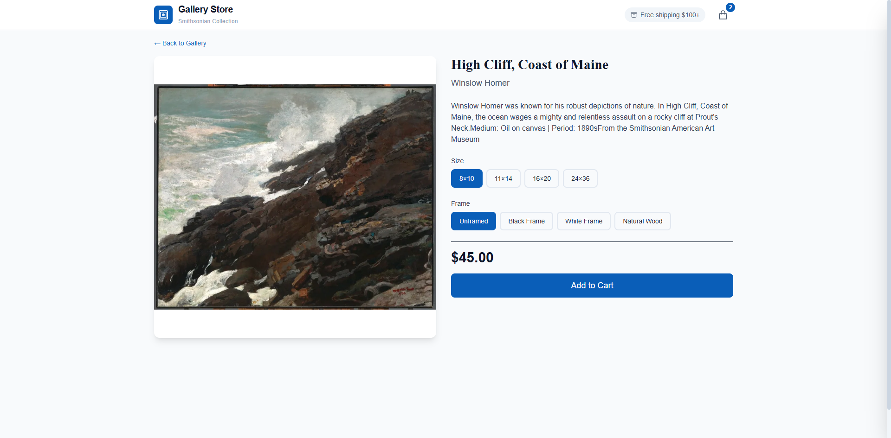

# Build Verification Report

**Date:** 2026-01-18
**Project:** Gallery Store - Headless Shopify Storefront
**Production URL:** https://ecommerce-react-shopify.vercel.app/

---

## Verification Summary

| Check | Status | Details |
|-------|--------|---------|
| TypeScript | ✅ PASS | Zero errors, strict mode enabled |
| ESLint | ✅ PASS | Zero errors, zero warnings |
| Production Build | ✅ PASS | Built in 2.28s |
| Hydration Errors | ✅ PASS | Zero React hydration errors |
| Cart Persistence | ✅ PASS | localStorage sync working |
| Cross-Tab Sync | ✅ PASS | StorageEvent listener active |
| Lighthouse | ✅ PASS | 98/95/96/100 |

---

## Lighthouse Audit

**Full Report:** [lighthouse-report.html](./screenshots/lighthouse-report.html)

| Category | Score | Status |
|----------|-------|--------|
| Performance | **98** | 🟢 |
| Accessibility | **95** | 🟢 |
| Best Practices | **96** | 🟢 |
| SEO | **100** | 🟢 |

### Performance Breakdown
- First Contentful Paint: Fast
- Largest Contentful Paint: Fast
- Total Blocking Time: Minimal
- Cumulative Layout Shift: Low
- Server-Side Rendering: Enabled

---

## TypeScript Verification

```bash
$ npm run typecheck

> gallery-store@1.0.0 typecheck
> tsc --noEmit

# Exit code: 0 (success)
```

**Configuration:** `tsconfig.json`
- Target: ES2020
- Strict mode: Enabled
- No unused locals/parameters enforced
- Path aliases configured (`@/*` → `src/*`)

---

## ESLint Verification

```bash
$ npm run lint

> gallery-store@1.0.0 lint
> eslint . --ext ts,tsx --report-unused-disable-directives --max-warnings 0

# Exit code: 0 (success)
```

**Rules Enforced:**
- React Hooks rules (prevents bugs)
- TypeScript strict rules (no `any`, unused vars)
- No console.log (only warn/error/info allowed)
- No duplicate imports
- React Router 7 patterns allowed

---

## Production Build Verification

```bash
$ npm run build

> gallery-store@1.0.0 build
> react-router build

vite v5.4.21 building for production...
✓ 65 modules transformed.
✓ built in 2.28s

vite v5.4.21 building SSR bundle for production...
✓ 20 modules transformed.
✓ built in 570ms
```

**Build Output:**
| File | Size | Gzipped |
|------|------|---------|
| entry.client.js | 136.98 kB | 44.34 kB |
| chunk-SYFQ2XB5.js | 103.09 kB | 34.89 kB |
| root.css | 31.46 kB | 6.81 kB |

---

## Hydration Verification

**Test Method:** Playwright browser automation on production URL

**Console Errors Captured:**
```
[ERROR] Failed to load resource: 404 @ favicon.ico
```

**Hydration Errors:** **NONE**

The `useSyncExternalStore` implementation successfully prevents React hydration mismatches by:
1. Returning empty cart from `getServerSnapshot()` during SSR
2. Matching that empty state during initial client hydration
3. Loading localStorage data after hydration completes

---

## Screenshots

### Homepage


### Product Page


---

## Test Commands Reference

```bash
# Type checking
npm run typecheck

# Linting
npm run lint

# Production build
npm run build

# Unit tests
npm run test

# E2E tests
npm run test:e2e

# Full validation suite
npm run validate
```

---

## Environment

| Component | Version |
|-----------|---------|
| Node.js | 18+ |
| React | 18.2.0 |
| React Router | 7.1.3 |
| TypeScript | 5.3.0 |
| Vite | 5.4.21 |
| Tailwind CSS | 4.0.0 |

---

## Deployment

**Platform:** Vercel
**Framework:** react-router
**Build Output:** `build/client`

**Automatic Deployments:**
- Push to `main` → Production deployment
- Pull requests → Preview deployments

---

*Report generated during SSR-safe persistence implementation verification.*
